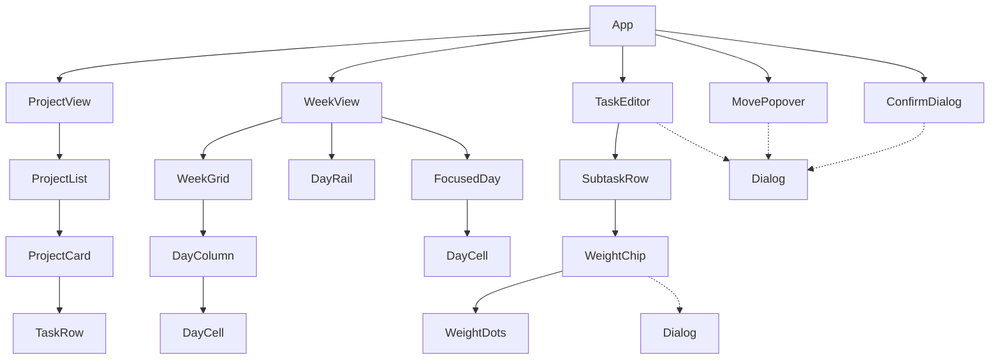
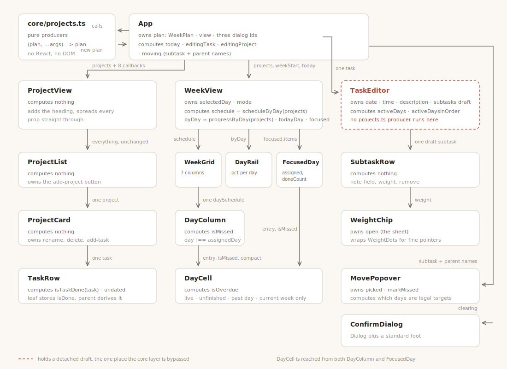

# Architecture

How the running app is put together: who owns which piece of state, what each component
computes, what it hands to which child, and what it renders. Domain rules live in `core/`;
this document covers the React layer on top of it.

Companion documents: [conventions.md](./conventions.md) for coding rules,
[week-model.md](./week-model.md) for the week and day model.

## Contents

Everything below is covered in this order.

```
App                              owns plan: WeekPlan, view, open-dialog ids
│
├── Plan view
│   ├── ProjectView              heading only, spreads props
│   │   └── ProjectList          maps projects, add-project button
│   │       └── ProjectCard      one project: name, actions, task list
│   │           └── TaskRow      one task: checkbox, name, actions
│   │
│   └── WeekView                 owns selectedDay + mode, derives the schedule
│       ├── WeekGrid             7 columns
│       │   └── DayColumn        one day's heading and cells
│       │       └── DayCell      one scheduled subtask
│       ├── DayRail              7 weekday pills with progress
│       └── FocusedDay           one day in full
│           └── DayCell          same component, not compact
│
└── Overlay system
    ├── Dialog                   base: portal, scrim, focus, Escape stack
    ├── TaskEditor               owns a draft of the task being edited
    │   └── SubtaskRow           one draft subtask
    │       └── WeightChip       pips, opens a sheet on coarse pointers
    │           └── WeightDots   fine-pointer variant
    ├── MovePopover              owns picked day + mark-missed
    └── ConfirmDialog            Dialog plus a standard foot

Kit          Grip, CloseIcon, EditIcon, MoveIcon, DeadlineIcon
Shared CSS   checkbox, rowKit, dialogShell, moveUi
```

Three components own state: `App`, `WeekView`, and `TaskEditor`. Everything else is a
function of its props.

## State ownership

There is exactly one source of truth for user data: the `WeekPlan` held by `App`. Every
edit goes through a pure producer in `core/projects.ts`, which returns a new plan.

Every hand-off is drawn, with labels, in the
[props flow diagram](./diagrams/props-flow.svg) further down.

The three state owners hold three different kinds of state, and the distinction is the
point:

**`App` owns user data.** The plan is what gets saved. Everything below edits it by calling
a callback, never directly.

**`WeekView` owns view state.** Which day you are looking at, and grid versus focus mode.
This is not user data: it does not need saving, does not belong in the plan, and no other
part of the app needs to read it.

**`TaskEditor` owns a draft.** While it is open, its copy of the subtasks and the plan
disagree, which is exactly what makes Cancel work. It is the one place no producer from
`projects.ts` runs: every one of them is typed over `WeekPlan`, and the editor holds a
detached list of subtasks. It does still use `core/`, calling `parseDeadline` when it opens
and `buildTask` when it saves.

Note that both approaches to editing exist in the app on purpose. Name fields in
`ProjectCard` and `TaskRow` are controlled inputs that run a producer per keystroke, with
no draft, because there is nothing to cancel. A dialog that edits several fields at once
needs a draft so Cancel can revert all of them together.

## Component tree



`DayCell` appears twice on purpose: the same component renders both a cell in the 7 column
grid (with `compact`) and a row in the focused single-day view.

`Dialog` is drawn with dashed edges because it is a wrapper, not a child. Everything modal
renders through it, and it is what puts the panel in a portal on `document.body`.

## Derivation and hand-off

What each component computes, and what it passes to which specific child. Components that
compute nothing are worth noting as such: a pure pass-through is a design choice, not an
omission.



The same information follows in text, one block per component, in tree order.

### App

```
owns       view, plan, editingTaskId, movingSubtaskId, clearing
computes   today          = todayKey()
           editingProject = the project whose tasks contain editingTaskId
           editingTask    = that project's task with editingTaskId
           moving         = findSubtask(plan, movingSubtaskId)
                            -> { subtask, taskName, projectName }
passes     projects, 8 callbacks                          -> ProjectView
           projects, weekStart, today, 4 callbacks         -> WeekView
           editingTask, editingProject.name                -> TaskEditor
           moving.*, weekStart, today                      -> MovePopover
           clearing.*                                      -> ConfirmDialog
```

Dialogs are driven by a stored id, not a boolean. `App` looks the id up in the *current*
plan each render and renders the dialog only when the lookup succeeds, so a stale id
renders nothing rather than rendering against missing data.

`findSubtask` is a local helper that walks the tree for a subtask id and returns it with
its parent names, which the dialogs need for their headings.

### ProjectView

```
receives   projects, 8 callbacks                           from App
computes   nothing
passes     all of it, unchanged, via {...props}            -> ProjectList
```

It exists only to add the "Projects" heading. Worth knowing so you do not go looking for
logic here.

### ProjectList

```
receives   projects, 8 callbacks                           from ProjectView
computes   nothing
uses here  onAddProject                                    (the add-project button)
passes     project, 7 callbacks, one per project           -> ProjectCard
```

### ProjectCard

```
receives   project, 7 callbacks                            from ProjectList
computes   nothing
uses here  onRenameProject, onRemoveProject, onAddTask
passes     task, onEditTask, onToggleTask,
           onRenameTask, onRemoveTask, one per task        -> TaskRow
```

### TaskRow

```
receives   task, 4 callbacks                               from ProjectCard
computes   isTaskDone(task)   the checkbox state
           undated            task has no subtasks
passes     nothing (leaf)
```

A task with no subtasks is a leaf and stores its own `isDone`. A task with subtasks derives
doneness from them, which is why the checkbox reads `isTaskDone(task)` and not
`task.isDone`. `undated` drives the nudge toward assigning days.

### WeekView

The only non-root component that both owns state and derives values.

```
receives   projects, weekStart, today, 4 callbacks         from App
owns       selectedDay, mode
computes   schedule = scheduleByDay(projects)     7 days, each with its entries
           byDay    = progressByDay(projects)     per-day assigned and done weight
           todayDay = todayInWeek(weekStart)      undefined if not the current week
           focused  = schedule entry for selectedDay
passes     schedule, weekStart, today,
           onFocusDay + 4 callbacks                        -> WeekGrid
           byDay, selectedDay, todayDay,
           onSelectDay, onBackToGrid                       -> DayRail
           focused.items, selectedDay, isToday,
           weekStart, today, 4 callbacks                   -> FocusedDay
```

`schedule` and `byDay` are recomputed every render rather than stored. Both are pure and
cheap, and deriving them means they can never fall out of sync with the plan.

`todayDay` being `undefined` on a past or future week is what suppresses the "Focus today"
affordance there.

Both panes always render; `data-mode` plus CSS decides which is visible.

### WeekGrid

```
receives   schedule, weekStart, today, 5 callbacks         from WeekView
computes   nothing
passes     one daySchedule, weekStart, today,
           5 callbacks, one per day                        -> DayColumn
```

### DayColumn

```
receives   daySchedule, weekStart, today, 5 callbacks      from WeekGrid
computes   isMissed = daySchedule.day !== entry.subtask.assignedDay   per entry
uses here  onFocusDay                                      (the day heading button)
passes     entry, day, isMissed, weekStart, today,
           compact = true, 4 callbacks                     -> DayCell
```

`isMissed` is the important one. A subtask appears on its assigned day and on every day it
missed, so this flag tells the cell which of the two it is being rendered as.

### DayCell

```
receives   entry, day, isMissed, weekStart, today,
           compact, 4 callbacks              from DayColumn or FocusedDay
computes   isOverdue = not missed, not done, week is current,
                       and the assigned day is past
passes     nothing (leaf)
```

`isOverdue` is gated on the week being current, so browsing a past week does not light up
every unfinished cell.

### DayRail

```
receives   byDay, selectedDay, todayDay,
           onSelectDay, onBackToGrid                       from WeekView
computes   pct = percentOf(done, assigned)                 per day
passes     nothing (leaf)
```

Clicking the already-selected pill calls `onBackToGrid`, so the rail doubles as the way out
of focus mode.

### FocusedDay

```
receives   day, items, isToday, weekStart, today,
           4 callbacks                                     from WeekView
computes   assigned  = items whose assignedDay is this day  (ghosts excluded)
           doneCount = done ones among those
passes     entry, day, isMissed, weekStart, today,
           4 callbacks, compact omitted                    -> DayCell
```

The count measures `assigned`, not `items`: ghosts of subtasks that slipped away from this
day should not inflate its workload.

### TaskEditor

```
receives   task, projectName, onClose, onSave              from App
owns       date, time, description, subtasks               the draft
computes   seed             = task.deadline, ignored unless parseDeadline says ok
           activeDays       = set of assignedDays in the draft
           activeDaysInOrder = WEEK filtered to those, so groups stay Mon..Sun
passes     subtask, onSetWeight, onSetNote, onRemove       -> SubtaskRow
on save    buildTask(task, { description, subtasks, deadline }) -> onSave
```

`buildTask` is the pure function that decides leaf versus parent, drops a blank
description, and refuses to store an unparseable deadline. On open, a stored deadline that
does not parse is ignored rather than shown, so a corrupt value cannot be silently
rewritten by opening and saving.

Its five draft handlers, `toggleDay`, `addSubtaskOn`, `removeSubtask`, `setSubtaskWeight`
and `setSubtaskNote`, duplicate logic that exists as producers, for the typing reason given
under State ownership.

### SubtaskRow

```
receives   subtask, onSetWeight, onSetNote, onRemove       from TaskEditor
computes   nothing
passes     weight, onChange,
           label = subtask.description or undefined        -> WeightChip
```

### WeightChip and WeightDots

```
WeightChip   receives weight, onChange, label              from SubtaskRow
             owns     open        the sheet
             passes   weight, onChange                     -> WeightDots

WeightDots   owns     hint        which level is hovered or focused
```

Two presentations of one control. `WeightDots` is the fine-pointer version: three radio
segments with a hover hint. `WeightChip` shows the same pips as a button that opens a bottom
sheet on coarse pointers, with named options and what each counts for. CSS decides which is
visible; both call the same `onChange`.

### MovePopover

```
receives   subtask, taskName, projectName,
           weekStart, today, onMove, onClose               from App
owns       picked, markMissed
computes   assignedIndex, latestMissedIndex
           fromPast   = the current assigned day is in the past
           disabled   per day: is current, or at/before latest missed,
                      or past within the live week
           willMark   markMissed and fromPast and the move goes forward
passes     nothing (leaf)
```

The disabled rule mirrors `moveSubtask`'s precondition, so an illegal move cannot be
expressed rather than being rejected after the fact. Pick-then-confirm is deliberate:
selecting a day only stages it, and Move applies it.

### Dialog

```
receives   open, onClose, labelledBy, children
owns       a module-level stack of open dialog ids, plus this dialog's id
computes   whether this dialog is topmost, for Escape
```

Only the topmost dialog responds to Escape. That is what lets the weight sheet open inside
the task editor and close by itself without dismissing the editor underneath. Clicking the
scrim closes; clicks inside the panel stop propagating so they do not.

### ConfirmDialog

Pure composition: `Dialog` plus the standard head, body and Cancel/Confirm foot. Callers
supply the wording and the body content as children. Computes nothing.

## How an edit travels

Worth tracing once, because every interaction follows this path. Ticking a subtask checkbox
in the week grid:

1. `DayCell` fires `onToggleSubtask(subtask.id)`. It knows the id and nothing else.
2. The callback passes untouched through `DayColumn`, `WeekGrid`, `WeekView`.
3. `App.handleToggleSubtask` runs `setPlan(current => toggleSubtask(current, subtaskId))`.
4. `toggleSubtask` locates the subtask by id and returns a new plan, sharing every unchanged
   node by reference.
5. React re-renders. `WeekView` recomputes `schedule` and `byDay` from the new projects, so
   the grid, the rail percentages and the project tree all update together from one edit.

Note what is absent: nothing was looked up by array index, and nothing was mutated.

## Rendered shape

What each component actually puts on the page. Reading these blocks:

- `element.class` is the tag plus its CSS-module class name.
- `[.a .b]` are classes applied conditionally.
- `(if x)` marks a subtree that only renders under a condition.
- `-> handler` names the callback an element fires.

### App

```
nav.tabs                        plan | stats | archive
main.pane
└── div.plan-layout             (if view === 'plan')
    ├── ProjectView
    └── WeekView
TaskEditor                      (if editingTask)
MovePopover                     (if moving)
ConfirmDialog                   (if clearing)
```

### ProjectView and ProjectList

```
div.projectView
├── div.head > span.eyebrow     "Projects"
└── ProjectList
    ├── ProjectCard *           one per project
    └── button.addProject       -> onAddProject
```

### ProjectCard

```
section.card
├── div.header
│   ├── Grip.grip                           (not yet wired)
│   ├── input.name                          -> onRenameProject, controlled
│   └── div.actions
│       ├── button.iconBtn > DeadlineIcon   (not yet wired)
│       └── button.iconBtn > CloseIcon      -> onRemoveProject
├── ul.list
│   └── TaskRow *
└── button.addTask                          -> onAddTask
```

### TaskRow

```
li.row
├── Grip.grip                           (not yet wired)
├── input[checkbox].box                 -> onToggleTask, checked = isTaskDone(task)
├── input.name                          -> onRenameTask, controlled
├── button.assignHint                   (if undated) "assign days"
└── div.actions
    ├── button.iconBtn [.assignCta]     -> onEditTask
    └── button.iconBtn > CloseIcon      -> onRemoveTask
```

### WeekView

```
div.weekView [data-mode=grid|focus]
├── div.head > span.line        "Focus today" / "Focusing Wed, show all days"
├── div.weekGridPane
│   └── WeekGrid
└── div.focusPane
    ├── DayRail
    └── FocusedDay
```

### WeekGrid and DayColumn

```
div.grid
└── section.column *                    7 of them
    ├── button.day                      -> onFocusDay
    └── ul.list
        └── DayCell *   compact
```

### DayCell


```
li.cell [.compact .done .missed .overdue]
├── input[checkbox].box [.missedCheck]  -> onToggleSubtask
│                                          disabled + unchecked when isMissed
└── div.text                            -> onEditSubtask
    ├── div.eyebrow
    │   ├── span.project
    │   └── span.weight > span.pip x3   [.on] for pips <= weight
    ├── div.task
    ├── span.desc                       (if subtask.description)
    └── div.tagRow                      exactly one of:
        ├── missed:  span.missTag + button.clearBtn|clearPill  -> onClearMissed
        ├── overdue: span.overdueTag + button.moveBtn|movePill -> onRequestMove
        └── neither: nothing
```

A missed ghost is a historical record, so its checkbox is disabled and reads unchecked
regardless of whether the subtask was later completed elsewhere. `compact` shortens labels
and swaps pill buttons for icon buttons; it is passed by `DayColumn` and omitted by
`FocusedDay`, so the grid and the focus view can never drift apart.

### DayRail

```
div.rail
└── button.pill [.today .selected] *    7 of them
    ├── span.letter                     M T W T F S S
    └── span.bar > span.fill            width = percent
```

### FocusedDay

```
div.card
├── p.head                              "Wednesday, today"
├── p.count                             "2 of 5 done" | "nothing scheduled"
└── ul.list | p.empty
    └── DayCell *                       not compact
```

### TaskEditor

```
Dialog
├── div.head        eyebrow = project name, h3 = task name
├── div.body
│   ├── field: Deadline
│   │   └── div.deadrow > input[date] + input[time]   time disabled until date set
│   ├── field: Days
│   │   ├── div.days > button.day [.on] x7            -> toggleDay
│   │   ├── div.subs                                  (if any active day)
│   │   │   └── div.daygroup *                        one per active day
│   │   │       ├── div.daylabel
│   │   │       ├── SubtaskRow *                      that day's subtasks
│   │   │       └── button.addsub                     -> addSubtaskOn(day)
│   │   └── p.note
│   └── field: Note > textarea
└── div.foot        Cancel -> onClose | Save -> handleSave
```

### SubtaskRow

```
div.row
├── Grip.grip                           (not yet wired)
├── input.subnote                       -> onSetNote
├── WeightChip                          -> onSetWeight
└── button.iconBtn > CloseIcon          -> onRemove
```

### WeightChip

```
span.wrap
├── span.fine > WeightDots              fine pointers
├── button.chip > pips                  coarse pointers, opens the sheet
└── Dialog                              (if open)
    └── div.sheet
        ├── div.grab + h4 + p.sheetSub
        └── button.opt [.optSel] x3     Easy / Medium / Hard
```

### MovePopover

```
Dialog
├── div.head
├── div.body
│   ├── field: Move to
│   │   └── div.rail > button.pill [.cur .picked] x7   disabled when illegal
│   └── label.miss                      (if fromPast) "Mark Tue as missed"
└── div.foot        Cancel | Move (disabled until a day is picked)
```

## Where things are not wired yet

Kept current so the gaps are visible rather than surprising.

- **Grips** render in `ProjectCard`, `TaskRow` and `SubtaskRow` but do not drag. `Grip`
  reserves its slot so rows do not shift when it appears on hover.
- **The deadline button** on a project card does nothing; task deadlines are editable in
  `TaskEditor`.
- **Stats and archive** are placeholder panes.
- **Nothing persists.** `App` seeds from a fixture; the storage layer exists and is tested
  but is not connected to the UI.
