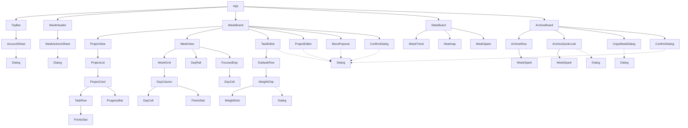
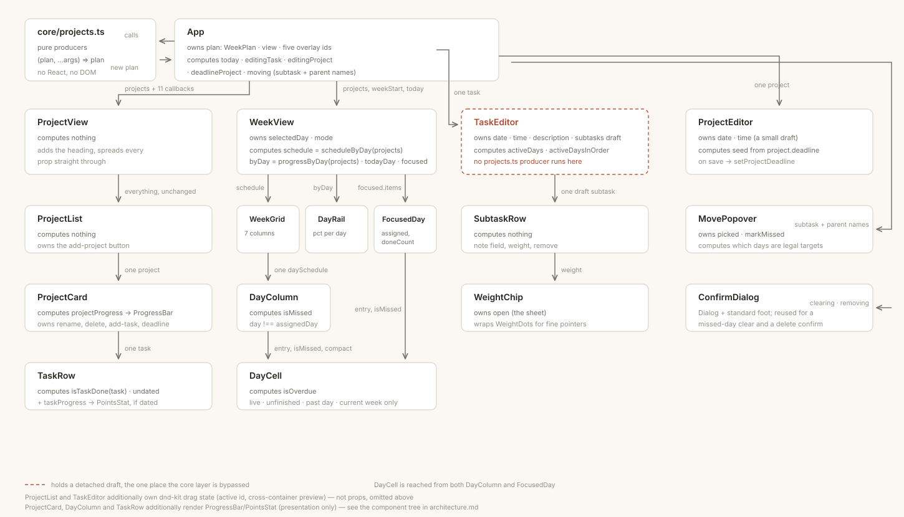

# Architecture

How the running app is put together: who owns which piece of state, what each component
computes, what it hands to which child, and what it renders. Domain rules live in `core/`;
this document covers the React layer on top of it.

Companion documents: [conventions.md](./conventions.md) for coding rules,
[week-model.md](./week-model.md) for the week and day model.

## Where these components live

`src/components/` is grouped by feature area, one level deep. Every component named
below sits in exactly one of these; see [conventions.md](./conventions.md) for the rule
that decides which.

| bucket | components |
|---|---|
| `week/` | `WeekBoard` `WeekView` `WeekGrid` `WeekHeader` `WeekActionsSheet` `DayColumn` `DayCell` `DayRail` `FocusedDay` `MovePopover` |
| `project/` | `ProjectView` `ProjectList` `ProjectCard` `ProjectEditor` `TaskRow` `TaskEditor` `SubtaskRow` `WeightChip` `WeightDots` |
| `archive/` | `ArchiveBoard` `ArchiveRow` `ArchiveQuickLook` `CopyWeekDialog` |
| `stats/` | `StatsBoard` `Heatmap` `WeekTrend` |
| `auth/` | `AuthForm` `ChangePasswordForm` `RecoveryScreen` `GuestMergeDialog` `GuestMergeSheet` |
| `account/` | `AccountMenu` `AccountSettings` `AccountSheet` `ChangeEmailForm` `ThemePicker` `DataPrivacyDialog` `Avatar` |
| `shell/` | `TopBar` |
| `shared/` | `Dialog` `ConfirmDialog` `ProgressBar` `PointsStat` `WeekSpark` `WeekRef`, plus `icons/` |

`shell/` is the frame that survives a view change; `shared/` is a leaf that the feature
buckets point into.

## Contents

Everything below is covered in this order. `App` now holds a `Weeks` collection (see
[week-model.md](./week-model.md)) rather than one `WeekPlan`, and switches between three
top-level views; the overlay-driving state that used to live on `App` moved down onto
`WeekBoard` when the plan view was split out from the chrome around it.

```
App                              owns weeks: Weeks, view, viewing, confirmingEndWeek
│
├── TopBar                       view switcher, theme toggle, support link, account slot
│   └── AccountSheet             phone-only: the same right cluster as a sheet
│
├── Plan view (view === 'plan')
│   ├── WeekHeader                week readout, progress gauge, Move / End week,
│   │   │                        owns armed-move state (destination) + its own sheet
│   │   └── WeekActionsSheet     phone-only: Move / End week as a sheet
│   │
│   └── WeekBoard                owns editingTaskId, editingDeadlineId, movingSubtaskId,
│       │                        clearing, removing
│       ├── ProjectView              heading only, spreads props
│       │   └── ProjectList          maps projects, add-project button, owns
│       │       │                    project/task drag-and-drop
│       │       └── ProjectCard      one project: name, deadline, progress bar, task list
│       │           └── TaskRow      one task: checkbox, name, points stat, actions
│       │
│       └── WeekView                 owns selectedDay + mode, derives the schedule
│           ├── WeekGrid             7 columns
│           │   └── DayColumn        one day's heading (+ points stat) and cells
│           │       └── DayCell      one scheduled subtask
│           ├── DayRail              7 weekday pills with progress
│           └── FocusedDay           one day in full
│               └── DayCell          same component, not compact
│
├── Stats view (view === 'stats')
│   └── StatsBoard                pure over the archive; the one piece of state
│       │                        it owns is a measured container width (a hook, not
│       │                        local state), for the trend's item count
│       ├── WeekTrend             week-by-week bars, oldest first, with untracked
│       │                        gaps drawn as breaks
│       ├── Heatmap + HeatmapLegend   a year of scheduled work, one column per week
│       └── WeekSpark  (x2)      weekday follow-through and distribution
│
└── Archive view (view === 'archive')
    └── ArchiveBoard              owns opened, copying, removing, clearingAll
        ├── ArchiveRow            one week: stat line + WeekSpark + actions
        ├── ArchiveQuickLook      read-only project/task rollup for one week
        └── CopyWeekDialog        picks which of a week's projects to copy

Overlay system (Plan tab; driven by WeekBoard, not App)
    ├── Dialog                   base: portal (into the app's own container box,
    │                            not document.body — see State ownership), scrim,
    │                            focus, Escape stack
    ├── TaskEditor               owns a draft of the task being edited, and
    │   │                        subtask drag-and-drop within that draft
    │   └── SubtaskRow           one draft subtask
    │       └── WeightChip       pips, opens a sheet on coarse pointers
    │           └── WeightDots   fine-pointer variant
    ├── ProjectEditor            one project's deadline, with a clear affordance
    ├── MovePopover              owns picked day + mark-missed
    └── ConfirmDialog            Dialog plus a standard foot; reused for clearing
                                 a missed day, delete-with-children confirms, ending
                                 a week, and both archive deletes

Progress display (presentation, not domain logic)
    PointsStat                   "n/total" text, optional "pts" suffix
    ProgressBar                  a filled bar, width = percent
    WeekSpark                    a row of bars over any caller-defined column shape
                                  (days of a week, weekdays summed across many, weights)
    all three take {done, total}-shaped inputs core/progress or core/archiveStats
    already returns

Drag and drop (dnd-kit)
    ProjectList                  DndContext + SortableContext for projects and tasks
    TaskEditor                   DndContext + SortableContext for subtasks in the draft
    dndReorder                   shared pure helper: dnd-kit's drop event -> the
                                  beforeId the core reorder producers take

Hooks
    useTheme                     light/dark, persisted to localStorage, mirrored onto
                                  <html data-theme>
    useContainerWidth            the app's own container box (not the browser
                                  viewport) — the JS counterpart to the app's
                                  @container app queries, for the few layout
                                  decisions CSS can't make on its own

Kit          Grip, CloseIcon, EditIcon, MoveIcon, DeadlineIcon, ChevronIcon, CopyIcon,
             HeartIcon, UserIcon
Shared CSS   checkbox, rowKit, dialogShell, moveUi
```

Eight components own state: `App`, `TopBar`, `WeekHeader`, `WeekBoard`, `WeekView`,
`TaskEditor`, `ProjectList` (its own drag-and-drop), and `ArchiveBoard`. Everything else
is a function of its props. `StatsBoard` is pure over its `archive` prop but calls
`useContainerWidth`, which owns state of its own (a ref and a measured width) —
`StatsBoard` itself still computes and stores nothing.

## State ownership

There is exactly one source of truth for user data: the `Weeks` collection held by `App`
(see [week-model.md](./week-model.md) — every week the user has touched, each an entry
with its own `weekStart` and an optional `ended` flag). Every edit goes through a pure
producer in `core/projects.ts` or `core/weeks.ts`, which returns a new collection or plan;
nothing is ever mutated in place.

Every hand-off within the Plan tab is drawn, with labels, in the
[props flow diagram](./diagrams/props-flow.svg) further down. That diagram predates the
`Weeks` model and the chrome split below and is due a regeneration — read it for the shape
of the Plan tab's internals, not for `App`'s current top-level props.

Eight components own state, and the distinction between what kind is the point:

**`App` owns user data**, plus which week is being viewed and which top-level tab is
open. `weeks: Weeks` is what gets saved; `viewing: DateKey` and `view` are navigation,
not data — they don't belong in `weeks` and nothing downstream needs to persist them.
Everything below edits `weeks` by calling a callback, never directly.

**`WeekBoard` owns the plan view's overlay-driving state** — `editingTaskId`,
`editingDeadlineId`, `movingSubtaskId`, `clearing`, `removing` — which used to live on
`App` before the plan view was split out from the top-level chrome (`TopBar`,
`WeekHeader`) around it. `App` only ever sees a `WeekPlan` (one entry of `weeks`, via
`weekAt`) and an `onChange` callback; it has no idea an editor is open. Dialogs are
driven by a stored id, not a boolean: `WeekBoard` looks the id up in the *current* plan
each render and renders the dialog only when the lookup succeeds, so a stale id (the
plan changed under it — e.g. the edited task was deleted elsewhere) renders nothing
rather than rendering against missing data.

**`WeekView` owns view state.** Which day you are looking at, and grid versus focus mode.
This is not user data: it does not need saving, does not belong in the plan, and no other
part of the app needs to read it.

**`TaskEditor` owns a draft.** While it is open, its copy of the subtasks and the plan
disagree, which is exactly what makes Cancel work. It is the one place no producer from
`projects.ts` runs: every one of them is typed over `WeekPlan`, and the editor holds a
detached list of subtasks. It does still use `core/`, calling `parseDeadline` when it opens
and `buildTask` when it saves.

Note that both approaches to editing exist in the app on purpose. Name fields in
`ProjectCard` and `TaskRow` are controlled inputs that run a producer per keystroke, with
no draft, because there is nothing to cancel. A dialog that edits several fields at once
needs a draft so Cancel can revert all of them together.

**`ProjectList` owns drag-and-drop state**, via [dnd-kit](https://dndkit.com): which
item is active, and a live `preview` array of projects used only while a task is
dragged across a project boundary — same-project reordering is left entirely to
dnd-kit, which opens the gap itself, because touching state there would fight its
animation and loop. `TaskEditor` owns the identical shape (`activeId` + a preview array
of subtasks) for dragging within its draft. Both feed the same pure helper,
`dndReorder.beforeIdForDrop`, which turns "what the pointer is over" into the `beforeId`
the core reorder producers (`reorderProject`, `reorderTask`, and the draft-local
subtask move) actually take. Neither owner reorders eagerly on every `dragover`: only a
*cross*-container move touches `preview`, and the commit in `onDragEnd` reads the
landing spot from that preview (or the untouched list, for a same-container drag) so
what gets committed always matches what the user was already looking at.

`ProjectList` also runs a custom `collisionDetection` (`closestCorners`, filtered to the
draggable's own kind) so a project drag only ever resolves against other projects and a
task drag only against task rows and project drop zones — without it, a nested task row
would swallow a project drop before the project list itself got a chance to open a gap.
`TaskEditor`'s drag-over handler additionally gates each candidate day through
`canMoveSubtaskTo`, so a subtask can never preview a landing on a day the miss rule
forbids — the same rule `MovePopover` applies to its day pills.

**`TopBar` owns which sheet is open** (`AccountSheet`, phone only) and delegates the
theme itself to `useTheme` — a hook, not local state, because the value needs to persist
across mounts and be readable by `index.html`'s pre-paint script before React ever runs.
`AccountSheet` owns nothing; it is handed the theme and a toggle callback and renders the
bar's right cluster as a dialog.

**`WeekHeader` owns two things**: the armed-move state (`destination: DateKey | null`,
doubling as "are we moving" and "where to" so the two can never disagree) and which
sheet is open (`WeekActionsSheet`, phone only). Neither is user data. Committing a move
calls back up to `App` with `(from, to)`; `WeekHeader` never touches `weeks` itself.
Once armed, `App` can also tell it *why* a given destination would be refused
(`destinationBlockedReason`, composed from `isAfterArchive`/`isEmptyWeek`/`weekAt`), so
an illegal target disables the commit button and explains itself instead of `moveWeek`
silently declining to commit.

**`ArchiveBoard` owns which dialog is open** — `opened` (quick-look), `copying`,
`removing`, `clearingAll` — the Archive tab's equivalent of `WeekBoard`'s overlay state,
same pattern (a stored entry rather than a boolean, so a stale reference renders
nothing).

Dialogs generally are portalled into the app's own container box
(`[data-app-container]`, established on `#root`), not `document.body` — see `Dialog`
below and `docs/conventions.md`'s note on `@container app`.

## Component tree


```mermaid
flowchart TD
    App --> TopBar --> AccountSheet
    App --> WeekHeader --> WeekActionsSheet
    App --> WeekBoard
    WeekBoard --> ProjectView --> ProjectList --> ProjectCard --> TaskRow
    ProjectCard --> ProgressBar1["ProgressBar"]
    TaskRow --> PointsStat1["PointsStat"]
    WeekBoard --> WeekView
    WeekView --> WeekGrid --> DayColumn --> DayCell
    DayColumn --> PointsStat2["PointsStat"]
    WeekView --> DayRail
    WeekView --> FocusedDay --> DayCell2["DayCell"]
    WeekBoard --> TaskEditor --> SubtaskRow --> WeightChip --> WeightDots
    WeekBoard --> ProjectEditor
    WeekBoard --> MovePopover
    WeekBoard --> ConfirmDialog1["ConfirmDialog"]
    App --> StatsBoard
    StatsBoard --> WeekTrend
    StatsBoard --> Heatmap
    StatsBoard --> WeekSpark1["WeekSpark"]
    App --> ArchiveBoard
    ArchiveBoard --> ArchiveRow --> WeekSpark2["WeekSpark"]
    ArchiveBoard --> ArchiveQuickLook --> WeekSpark3["WeekSpark"]
    ArchiveBoard --> CopyWeekDialog
    ArchiveBoard --> ConfirmDialog2["ConfirmDialog"]
    TaskEditor -.-> Dialog
    ProjectEditor -.-> Dialog
    MovePopover -.-> Dialog
    ConfirmDialog1 -.-> Dialog
    ConfirmDialog2 -.-> Dialog
    WeightChip -.-> Dialog2["Dialog"]
    AccountSheet -.-> Dialog3["Dialog"]
    WeekActionsSheet -.-> Dialog4["Dialog"]
    ArchiveQuickLook -.-> Dialog5["Dialog"]
    CopyWeekDialog -.-> Dialog6["Dialog"]
```

Repeated leaves get a numbered node the way `DayCell`/`Dialog` already did: `ProgressBar`,
`PointsStat`, `WeekSpark`, `ConfirmDialog`, and `Dialog` itself each appear more than once
because they are the same component reused in different places, not different components
that happen to share a name. `CopyWeekDialog` renders through `ConfirmDialog`, not `Dialog`
directly, which is why it isn't drawn with a dashed edge here — see its own section below.

`DayCell` appears twice on purpose: the same component renders both a cell in the 7 column
grid (with `compact`) and a row in the focused single-day view.

`Dialog` is drawn with dashed edges because it is a wrapper, not a child. Everything modal
renders through it, and it is what puts the panel in a portal — into the app's own
`[data-app-container]` box when one exists (so the overlay stays inside the app's own box
rather than the browser viewport if the app is embedded narrower than the page), falling
back to `document.body` otherwise, identical to the old unconditional behavior.

## Derivation and hand-off

What each component computes, and what it passes to which specific child. Components that
compute nothing are worth noting as such: a pure pass-through is a design choice, not an
omission.



**This diagram predates the `Weeks` collection, `TopBar`/`WeekHeader`, and the
Archive/Stats trees, and is due a regeneration.** It still correctly covers the Plan
tab's interior — everything from `ProjectView`/`WeekView` down through `TaskEditor`,
`ProjectEditor`, `MovePopover`, and `ConfirmDialog` — since that subtree's own props
didn't change shape, only what sits above it did (`WeekBoard` now owns and hands down
what `App` used to). The text below is current for every component, diagrammed or not,
and is the source of truth wherever the two disagree.

Unlike the callbacks below, drag-and-drop needs nothing threaded down from a parent:
every draggable or droppable component calls dnd-kit's own hooks (`useSortable` /
`useDroppable`) directly with just its own id and a small `data` tag saying what kind of
node it is (`ProjectCard`, `TaskRow`, `SubtaskRow` each do this). `ProjectList` and
`TaskEditor` own the `DndContext` those hooks register into, but that context is
ambient, not a prop — so it is left out of the blocks below the same way an ordinary
React context would be.

### App

```
owns       weeks, view, viewing, confirmingEndWeek
computes   currentWeek  = weekStartOf(new Date())
           plan         = weekAt(weeks, viewing)
           overall      = overallProgress(plan.projects)
           archive      = endedWeeks(weeks)
           ended        = isEnded(plan)
           empty        = isEmptyWeek(plan)
           canMove      = !empty && !ended
           canEnd       = canEndWeek(weeks, viewing, currentWeek)
           plannable    = isAfterArchive(weeks, viewing)
           archiveBound = lastEndedWeek(weeks)
           queueHead    = earliestActiveWeek(weeks, currentWeek)
           headerNote   = prose explaining the viewed week's state, or undefined
                          on an ordinary live week (embeds WeekRef where it
                          names another week)
           moveBlockReason(destination) = why an armed destination is illegal,
                          or undefined — composed from isAfterArchive/isEmptyWeek/
                          weekAt, not a new core function
passes     view, 1 callback                                            -> TopBar
           viewing, overall, canMove, canEnd, ended, headerNote,
           bounds, moveBlockReason, 3 callbacks                        -> WeekHeader
           plan, readOnly = !plannable, 1 callback                     -> WeekBoard
           archive, 1 callback                                         -> StatsBoard
           archive, 1 callback                                         -> ArchiveBoard
           hasUnfinished, 2 tones of ConfirmDialog                     -> (end-week confirm)
```

The overlay-driving state (`editingTaskId`, `movingSubtaskId`, and the rest) that used
to live here moved down onto `WeekBoard` — see State ownership. `App` itself now only
ever hands `WeekBoard` one `WeekPlan` (`weekAt(weeks, viewing)`) and an `onChange`
callback that folds an updater back into `weeks` via `putWeek`; it has no idea whether an
editor is open underneath it.

`headerNote` is the one place `App` produces user-facing prose rather than plain data,
because the reasons a week reads the way it does (behind the archive, waiting on an
older week to end, frozen) all live in `App`'s own derived booleans — `WeekHeader`
would otherwise have to re-derive them just to explain itself.

Ending a week is two calls composed by the confirm dialog's two actions: "Clear all" is
`endWeek`; "Carry forward" is `carryForward(endWeek(...))`. Both re-anchor the view onto
`nextWeekStart(viewing)`.

### TopBar

```
receives   view, onView                                    from App
owns       which sheet is open (AccountSheet, phone only); the theme itself
           lives in useTheme, not here
passes     view, onView                                    -> nav (the three tabs)
           theme, toggleTheme, supportUrl                   -> AccountSheet
```

Same markup at every width; only the CSS moves it between a desktop bar and a phone's
floating bottom pill. The account slot (phone only) is what opens `AccountSheet` — on
desktop the same controls (Support, theme, guest/sign-in) render directly in the bar
instead.

### AccountSheet

```
receives   theme, supportUrl, onClose, onToggleTheme        from TopBar
computes   nothing
passes     nothing (leaf)
```

The phone's home for the bar's right cluster — Support, theme, sign-in — reusing
`WeekActionsSheet`'s stylesheet, since both are the same shape: a dialog of
rows-with-a-sentence. Sign in is `disabled`, not omitted, with a `title` explaining why.

### WeekHeader

```
receives   weekStart, today, progress, canMove, canEnd, ended, note,
           bounds, destinationBlockedReason, 3 callbacks    from App
owns       destination (armed-move target, null = idle), which sheet is open
           (WeekActionsSheet, phone only)
computes   currentWeek     = weekStart minus the weeks between it and today
           shown           = destination ?? weekStart
           aimedAtSource   = destination === weekStart
           blockedReason   = destinationBlockedReason(shown), only once armed
                             and off the source
           pct             = percentOf(progress.done, progress.total)
passes     weekLabel, canMove, canEnd, 3 callbacks           -> WeekActionsSheet
on commit  onMoveWork(weekStart, destination)
```

Arming state is one value, not two: `destination: DateKey | null` carries both "are we
moving" and "where to" at once, so the two can never disagree. It starts armed onto the
*source* itself (not source + 1), so the first arrow press in either direction is the
first real choice, and committing is dead until one is made. `blockedReason` — computed
by `App`, not here — replaces the destination note and disables the commit button
whenever the aimed week is illegal, instead of letting Move silently do nothing.

### WeekActionsSheet

```
receives   weekLabel, canMove, canEnd, onClose, onMove, onEnd  from WeekHeader
computes   nothing
passes     nothing (leaf)
```

The narrow-screen home for Move and End week, each with a sentence explaining it —
neither fits beside the gauge on a phone, and a bare label doesn't explain itself.
Picking either one closes the sheet before the corresponding flow opens.

### WeekRef

```
receives   weekStart, onView
computes   label = weekRangeLabel(weekStart)
passes     nothing (leaf)
```

Not a tree node so much as an inline control: a button styled like a link, used
wherever prose (`App`'s `headerNote`, `StatsBoard`'s "Best week" caption) names a week
that isn't the one on screen. A button, not a real link, since there is no router and so
no URL to point at.

### WeekBoard

```
receives   plan, onChange, readOnly                         from App
owns       editingTaskId, editingDeadlineId, movingSubtaskId, clearing, removing
computes   today            = todayKey()
           editingProject   = the project whose tasks contain editingTaskId
           editingTask      = that project's task with editingTaskId
           deadlineProject  = plan.projects.find(p => p.id === editingDeadlineId)
           moving           = findSubtask(plan, movingSubtaskId)
                              -> { subtask, taskName, projectName }
passes     projects, readOnly, 11 callbacks                 -> ProjectView
           projects, weekStart, today, ended = isEnded(plan),
           readOnly, 4 callbacks                            -> WeekView
           editingTask, editingProject.name                 -> TaskEditor
           deadlineProject                                  -> ProjectEditor
           moving.*, weekStart, today                       -> MovePopover
           clearing.*                                       -> ConfirmDialog (clear)
           removing.*                                       -> ConfirmDialog (delete)
```

Everything below `WeekBoard` is exactly what used to hang off `App` directly (see the
`### App` history above `TopBar`/`WeekHeader` were split out) — this component is that
whole old subtree, now behind one `plan`/`onChange`/`readOnly` interface so `App` only
has to think about which `WeekPlan` is being edited, not how.

Dialogs are driven by a stored id, not a boolean. `WeekBoard` looks the id up in the
*current* plan each render and renders the dialog only when the lookup succeeds, so a
stale id renders nothing rather than rendering against missing data.

`findSubtask` is a local helper that walks the tree for a subtask id and returns it with
its parent names, which the dialogs need for their headings.

`ConfirmDialog` is instantiated twice with different driving state (`clearing` and
`removing`), never both at once — they share a component, not an identity.

`readOnly` and `ended` are two different questions passed down together: `ended` is
"is this week frozen," used for display (the missed-styling on unfinished cells);
`readOnly` is "can anything here be edited at all" (ended, *or* the week sits behind the
archive bound and storing an edit there would break the collection's invariant — see
`isValidWeeks`). A week can be `readOnly` without being `ended`.

### ProjectView

```
receives   projects, readOnly, 11 callbacks                from WeekBoard
computes   nothing
passes     all of it, unchanged, via {...props}            -> ProjectList
```

It exists only to add the "Projects" heading, and to carry `inert={readOnly}` on its own
root — one attribute takes every button, checkbox and drag handle in the whole subtree
out of play at once. Worth knowing so you do not go looking for logic here.

### ProjectList

```
receives   projects, 11 callbacks                          from ProjectView
owns       active drag id, a preview project order (cross-project task drags only)
computes   nothing (see Drag and drop, below)
uses here  onAddProject                                    (the add-project button)
passes     project, 8 callbacks, one per project            -> ProjectCard
```

### ProjectCard

```
receives   project, 8 callbacks                            from ProjectList
computes   projectProgress(project)                        -> ProgressBar
uses here  onRenameProject, onRemoveProject, onAddTask, onEditDeadline
passes     task, projectId, onEditTask, onToggleTask,
           onRenameTask, onRemoveTask, one per task        -> TaskRow
```

### TaskRow

```
receives   task, projectId, 4 callbacks                    from ProjectCard
computes   isTaskDone(task)     the checkbox state
           undated              task has no subtasks
           taskProgress(task)   -> PointsStat, skipped when undated
passes     nothing (leaf)
```

A task with no subtasks is a leaf and stores its own `isDone`. A task with subtasks derives
doneness from them, which is why the checkbox reads `isTaskDone(task)` and not
`task.isDone`. `undated` drives the nudge toward assigning days.

### WeekView

The only non-root component that both owns state and derives values.

```
receives   projects, weekStart, today, ended, readOnly, 4 callbacks   from WeekBoard
owns       selectedDay, mode
computes   schedule = scheduleByDay(projects)     7 days, each with its entries
           byDay    = progressByDay(projects)     per-day assigned and done weight
           todayDay = todayInWeek(weekStart)      undefined if not the current week
           focused  = schedule entry for selectedDay
passes     schedule, byDay, weekStart, today, ended, readOnly,
           onFocusDay + 4 callbacks                        -> WeekGrid
           byDay, selectedDay, todayDay,
           onSelectDay, onBackToGrid                       -> DayRail
           focused.items, selectedDay, isToday, ended, readOnly,
           weekStart, today, 4 callbacks                   -> FocusedDay
```

`ended`/`readOnly` pass straight through to both panes without being read here — the day
picker itself (which day you're *looking at*) stays live on a frozen week; only the two
panes' own content is what `inert` reaches.

`schedule` and `byDay` are recomputed every render rather than stored. Both are pure and
cheap, and deriving them means they can never fall out of sync with the plan.

`todayDay` being `undefined` on a past or future week is what suppresses the "Focus today"
affordance there.

Both panes always render; `data-mode` plus CSS decides which is visible.

### WeekGrid

```
receives   schedule, byDay, weekStart, today, ended, readOnly, 5 callbacks   from WeekView
computes   nothing
passes     one daySchedule, progress = byDay[i], weekStart, today, ended,
           5 callbacks, one per day                        -> DayColumn
```

### DayColumn

```
receives   daySchedule, progress, weekStart, today, ended, readOnly,
           5 callbacks                                     from WeekGrid
computes   isMissed = daySchedule.day !== entry.subtask.assignedDay   per entry
uses here  onFocusDay                                      (the day heading, with
           progress -> PointsStat, shown when the day has any assigned weight)
passes     entry, day, isMissed, weekStart, today, ended,
           compact = true, 4 callbacks                     -> DayCell
```

`isMissed` is the important one. A subtask appears on its assigned day and on every day it
missed, so this flag tells the cell which of the two it is being rendered as. `inert` sits
on the `<ul>` of cells specifically, not the day heading above it — clicking a day to look
at it is navigation, and stays live on a frozen week even while its contents don't.

### DayCell

```
receives   entry, day, isMissed, weekStart, today, ended,
           compact, 4 callbacks              from DayColumn or FocusedDay
computes   showsMissed = isMissed || (ended && !subtask.isDone)
           isOverdue   = not showsMissed, not done, week is current,
                         and the assigned day is past
passes     nothing (leaf)
```

`isOverdue` is gated on the week being current, so browsing a past week does not light up
every unfinished cell — and now also excludes `showsMissed`, so an ended current week
never shows "overdue · reschedule?" beside a Move button that would no-op.

`showsMissed` is one user-facing concept covering two causes that read identically to the
person looking at the board: a subtask that was moved off this day (`isMissed`), or a
subtask that simply wasn't done when the week was closed out (`ended && !isDone`). Same
styling, same tag, no second label — an earlier version gave the ended case its own "not
done" tag and it was cut on purpose, as a concept the user shouldn't have to learn. Only
the parts specific to a *recorded* move — the "· now on Wed" note, the Clear button — are
still gated on `isMissed` alone, since there is nothing to clear and nowhere for an
unfinished-but-never-moved subtask to have moved to. This is presentation only: nothing
here writes to `missedDays`, which would double-count the subtask's weight in
`progressByDay` and violate `isValidSubtask`'s "never the subtask's own day" rule.

### DayRail

```
receives   byDay, selectedDay, todayDay,
           onSelectDay, onBackToGrid                       from WeekView
computes   pct = percentOf(done, assigned)                 per day
passes     nothing (leaf)
```

Clicking the already-selected pill calls `onBackToGrid`, so the rail doubles as the way out
of focus mode.

### FocusedDay

```
receives   day, items, isToday, weekStart, today, ended, readOnly,
           4 callbacks                                     from WeekView
computes   assigned  = items whose assignedDay is this day  (ghosts excluded)
           doneCount = done ones among those
passes     entry, day, isMissed, weekStart, today, ended,
           4 callbacks, compact omitted                    -> DayCell
```

The count measures `assigned`, not `items`: ghosts of subtasks that slipped away from this
day should not inflate its workload. `inert={readOnly}` sits on the `<ul>` here too, same
reasoning as `DayColumn`.

### TaskEditor

```
receives   task, projectName, onClose, onSave              from WeekBoard
owns       date, time, description, subtasks               the draft
computes   seed             = task.deadline, ignored unless parseDeadline says ok
           activeDays       = set of assignedDays in the draft
           activeDaysInOrder = WEEK filtered to those, so groups stay Mon..Sun
passes     subtask, onSetWeight, onSetNote, onRemove       -> SubtaskRow
on save    buildTask(task, { description, subtasks, deadline }) -> onSave
```

`buildTask` is the pure function that decides leaf versus parent, drops a blank
description, and refuses to store an unparseable deadline. On open, a stored deadline that
does not parse is ignored rather than shown, so a corrupt value cannot be silently
rewritten by opening and saving.

Its five draft handlers, `toggleDay`, `addSubtaskOn`, `removeSubtask`, `setSubtaskWeight`
and `setSubtaskNote`, duplicate logic that exists as producers, for the typing reason given
under State ownership.

### SubtaskRow

```
receives   subtask, onSetWeight, onSetNote, onRemove       from TaskEditor
computes   nothing
passes     weight, onChange,
           label = subtask.description or undefined        -> WeightChip
```

### WeightChip and WeightDots

```
WeightChip   receives weight, onChange, label              from SubtaskRow
             owns     open        the sheet
             passes   weight, onChange                     -> WeightDots

WeightDots   owns     hint        which level is hovered or focused
```

Two presentations of one control. `WeightDots` is the fine-pointer version: three radio
segments with a hover hint. `WeightChip` shows the same pips as a button that opens a bottom
sheet on coarse pointers, with named options and what each counts for. CSS decides which is
visible; both call the same `onChange`.

### ProjectEditor

```
receives   project, onClose, onSave                        from WeekBoard
owns       date, time                                       the draft
computes   seed = project.deadline, ignored unless parseDeadline says ok
on save    date ? (time ? `${date}T${time}` : date) : undefined -> onSave
passes     nothing (leaf)
```

The same shape as `TaskEditor`'s deadline field, deliberately: a stored deadline that
does not parse is ignored on open rather than shown, so a corrupt value cannot be
silently rewritten by opening and saving. Unlike `TaskEditor`, there is nothing else to
draft, so `WeekBoard` skips the id-lookup dance and passes the `Project` directly.

### MovePopover

```
receives   subtask, taskName, projectName,
           weekStart, today, onMove, onClose               from WeekBoard
owns       picked, markMissed
computes   assignedIndex, latestMissedIndex
           fromPast   = the current assigned day is in the past
           disabled   per day: is current, or at/before latest missed,
                      or past within the live week
           willMark   markMissed and fromPast and the move goes forward
passes     nothing (leaf)
```

The disabled rule mirrors `moveSubtask`'s precondition, so an illegal move cannot be
expressed rather than being rejected after the fact. Pick-then-confirm is deliberate:
selecting a day only stages it, and Move applies it.

### Dialog

```
receives   open, onClose, labelledBy, children
owns       a module-level stack of open dialog ids, plus this dialog's id
computes   whether this dialog is topmost, for Escape
```

Only the topmost dialog responds to Escape. That is what lets the weight sheet open inside
the task editor and close by itself without dismissing the editor underneath. Clicking the
scrim closes; clicks inside the panel stop propagating so they do not.

That same stack doubles as the reference count for the background scroll lock: the page is
locked when the stack goes from empty to one and unlocked only when it returns to empty, so
a nested dialog closing cannot unlock the page while its parent is still open. The lock
itself is `html.dialogOpen { overflow-y: hidden }`, not `position: fixed` on the body —
seizing the body was tried first and caused a real bug (see
[known-issues.md](./known-issues.md)): taking `<body>` out of flow left `<html>` with no
in-flow content, collapsing the document height to `0` on every open and springing it back
on every close, which could leave a compositor artifact on screen for one frame. Locking
`<html>`'s overflow instead keeps both elements' geometry untouched, so there is no scroll
position to save and restore either.

### ConfirmDialog

Pure composition: `Dialog` plus the standard head, body and Cancel/Confirm foot. Callers
supply the wording and the body content as children. Computes nothing.

## StatsBoard, WeekTrend, Heatmap, WeekSpark

Everything in the Stats tab is pure over the `archive` (= `Weeks` filtered to `ended`)
`App` hands it — the live week is never measured, only what's actually been closed out.

### StatsBoard

```
receives   archive, onOpenWeek                              from App
owns       a measured container width, via useContainerWidth
computes   history      = weekHistory(archive)               chronological, one per
                                                              ended week
           wide         = containerWidth >= 641               same number as the
                                                              stylesheet's own breakpoint
           pooledDone/Total  = summed across history          (see below)
           best         = bestWeek(history)
           streak       = currentStreak(history, 50)
           longest      = longestStreak(history, 50)
           items        = weekTrend(history, wide ? 16 : 8)
           completions  = dailyCompletions(archive)
           columns      = heatColumns(completions, tracked weeks, this week, today)
           weekdays     = weekdayHistory(archive)
           strongest, biggestShare = the two weekdays the two captions name
           distribution, followed  = weekdays reshaped for the two WeekSpark charts
passes     items, slots = wide ? 16 : 8                      -> WeekTrend
           columns                                           -> Heatmap
           followed, figures                                 -> WeekSpark (Follow-through)
           distribution, figures, figureOf                   -> WeekSpark (Distribution)
           best.weekStart, onOpenWeek                        -> WeekRef (in the
                                                              "Best week" caption)
```

The pooled average sums done and total across every week before dividing, rather than
averaging each week's own percentage — a real statistical choice, not an oversight,
because averaging percentages would weigh a 2-unit break week the same as a 16-unit
finals week.

`items`'s column count is a real prop passed down, not a CSS trick hiding extra
columns: `WeekTrend` normalizes bar height against the biggest week it is actually
*shown*, so a hidden column could silently own the maximum and flatten every visible
bar. `wide` reads the same number (`641px`) the stylesheet's own `@container app
(min-width: 641px)` breakpoint uses, via `useContainerWidth` rather than a media query,
so the two switch together — see `docs/conventions.md`.

`distribution` and `followed` are the same `WeekSpark` shape used two different ways:
`followed` fixes every column's `assigned` to `100` so every bar is full height and only
the *fill* differs (comparing rates), while `distribution` sets `assigned = done` so
bars are solid and the figure printed under each is that day's share of everything
completed (the seven figures sum to 100%).

### WeekTrend

```
receives   items, slots                                     from StatsBoard
computes   maxTotal = the biggest week's total among items
           empty    = slots - items.length
passes     nothing (leaf)
```

Weeks fill from the left; whatever slots are left over draw as dashed, unfilled columns
at an illustrative height (`PLACEHOLDER_HEIGHTS`, indexed by absolute column position so
the skyline doesn't reshuffle as real weeks accrue into it) rather than flat nubs, so an
empty or partial chart shows the shape it's going to take. A `gap` item (an untracked
run between two ended weeks) draws as a labelled break in the row instead of closing the
distance up, so the chart never implies two weeks were consecutive when they weren't.

### Heatmap and HeatmapLegend

```
Heatmap        receives   columns, className
               computes   nothing (columns arrive pre-shaped from heatColumns)
               passes     nothing (leaf)

HeatmapLegend  receives   nothing
```

Three cell states, not two: `tracked`, `untracked` (no ended entry for that week — "no
record," drawn differently from a real zero week), and `future`. Scrolls to its own
right edge on mount/update, since the newest week is the rightmost column and the one
worth seeing on open.

### WeekSpark

```
receives   columns, className, figures, figureOf            from StatsBoard, ArchiveRow,
                                                              or ArchiveQuickLook
computes   maxAssigned = the biggest column's assigned weight
passes     nothing (leaf)
```

One chart recipe used at three call sites and two different scales: `StatsBoard` gives it
weekday sums across the whole archive, `ArchiveRow`/`ArchiveQuickLook` give it one week's
seven days. What a column *is* — and both percentages inside it — comes entirely from
the caller, which is what keeps the visual language identical everywhere it appears; a
caller showing only a subset of a larger shape must truncate before rendering, never hide
columns with CSS, or the bar-height normalization would be measuring against columns the
viewer can't see.

## ArchiveBoard, ArchiveRow, ArchiveQuickLook, CopyWeekDialog

### ArchiveBoard

```
receives   archive, onChange                                from App
owns       opened, copying, removing, clearingAll
computes   sorted  = archiveNewestFirst(archive)
           rows    = sorted with a year label + startsYear flag per entry
passes     entry, label, 3 callbacks                        -> ArchiveRow (one per week)
           entry, label, onClose, onEdit                     -> ArchiveQuickLook
           entry, label, onClose, onCopy                      -> CopyWeekDialog
           2 tones of ConfirmDialog                          -> (delete-one, clear-all)
```

Every year gets a heading, not only the years after a change in year: a week's label
(`"Jul 20 – Jul 26"`) carries no year of its own, so an unlabelled first group would be
undated. A week straddling New Year files under the year of its own Monday.

`onChange` still takes an `Archive`-shaped updater (`ReadonlyArray<WeekPlan>`) for
historical reasons — `Archive` is a `@deprecated` alias that happens to be structurally
identical to a `Weeks` subset, so `App`'s `endedWeeks(weeks)` satisfies it without a
conversion. `archiveWeek` itself (the function that used to *build* an archive entry) is
unused dead code under the current model — `endWeek`, not `archiveWeek`, is what actually
records a week now; only `archiveNewestFirst` and `removeArchived` are still live,
operating generically on whatever `ReadonlyArray<WeekPlan>` they're handed.

`ArchiveQuickLook`'s `onEdit` is currently a no-op (`() => {}` in `ArchiveBoard`); the
intended behavior is to jump the Plan tab to that week and unlock it.

### ArchiveRow

```
receives   entry, label, onOpen, onCopy, onDelete
computes   overall = overallProgress(entry.projects)
           pct     = percentOf(overall.done, overall.total)
           days    = weekdayColumns(progressByDay(entry.projects))
passes     days                                             -> WeekSpark
```

The whole row is a click target (`onOpen`); Copy and Delete are icon buttons layered on
top that call `stopPropagation` so clicking them doesn't also open the row underneath.

### ArchiveQuickLook

```
receives   entry, label, onClose, onEdit
computes   overall = overallProgress(entry.projects)
           pct     = percentOf(overall.done, overall.total)
           per project: projectProgress(project)
           per task: taskProgress(task), taskMisses(task)
passes     days = weekdayColumns(progressByDay(entry.projects))   -> WeekSpark
           taskDone                                               -> PointsStat
```

Read-only, and deliberately stops above subtask level: a `Subtask` is a single day with
no name of its own, so a subtask row would say almost nothing the real board (once
`Edit` is wired) wouldn't say better. `taskMisses` counts miss *events*, not distinct
days or subtasks, and this is its only caller.

### CopyWeekDialog

```
receives   entry, label, onClose, onCopy                    from ArchiveBoard
owns       excluded (a set of project ids)
computes   chosen    = entry.projects filtered to not-excluded
           allChosen = excluded.size === 0
on copy    onCopy(chosen)
```

Tracks *exclusions* rather than inclusions, so "everything selected" — the common case,
copying the whole week — is the empty set and needs no seeding from `entry.projects`.
`onCopy` receives the chosen projects themselves, in the week's own order, never ids, so
the caller (`ArchiveBoard.handleCopy`) can serialize what it's handed without a second
lookup. That caller's serializer is still a stub as of this writing (writes an empty
string to the clipboard) — the picker and selection logic above are real, only the
payload is not.

## How an edit travels

Worth tracing once, because every interaction follows this path. Ticking a subtask checkbox
in the week grid:

1. `DayCell` fires `onToggleSubtask(subtask.id)`. It knows the id and nothing else.
2. The callback passes untouched through `DayColumn`, `WeekGrid`, `WeekView`.
3. `WeekBoard.handleToggleSubtask` runs `onChange(current => toggleSubtask(current, subtaskId))`.
4. `App.handlePlanChange` folds that updater into `weeks`:
   `setWeeks(current => putWeek(current, updater(weekAt(current, viewing))))`.
5. `toggleSubtask` locates the subtask by id and returns a new plan, sharing every unchanged
   node by reference; `putWeek` then replaces that one entry in `weeks`, keeping the rest
   untouched by reference too.
6. React re-renders. `WeekView` recomputes `schedule` and `byDay` from the new projects, so
   the grid, the rail percentages and the project tree all update together from one edit.

Note what is absent: nothing was looked up by array index, and nothing was mutated. The
one extra hop versus the single-`WeekPlan` version of this app (`WeekBoard` handing an
updater up to `App` rather than calling `setPlan` directly) is the price of `App` owning a
collection instead of one plan — `WeekBoard` never sees `weeks` or `viewing` at all.

## Rendered shape

What each component actually puts on the page. Reading these blocks:

- `element.class` is the tag plus its CSS-module class name.
- `[.a .b]` are classes applied conditionally.
- `(if x)` marks a subtree that only renders under a condition.
- `-> handler` names the callback an element fires.

### App

```
TopBar
main.pane
├── WeekHeader + WeekBoard        (if view === 'plan')
├── StatsBoard                    (if view === 'stats')
└── ArchiveBoard                  (if view === 'archive')
ConfirmDialog                     (if confirmingEndWeek, one of two tones:
                                    unfinished work present, or nothing left undone)
```

`App` itself renders only the three top-level panes and the end-week confirmation —
every other dialog that used to hang directly off it (`TaskEditor`, `ProjectEditor`,
`MovePopover`, the clear/delete `ConfirmDialog`s) now renders from inside `WeekBoard`,
and the two archive `ConfirmDialog`s render from inside `ArchiveBoard`. See their own
sections below.

### TopBar

```
header.bar
└── div.inner
    ├── span.mark                 "beaverplans."
    ├── nav.tabs
    │   └── button [aria-current] *   3 of them, -> onView
    ├── a.util > HeartIcon + label     Support
    ├── button.iconBtn > theme half + label   -> toggleTheme
    ├── span.guest                "Guest" status readout
    ├── button.btn [disabled]     "Sign in"
    └── button.you > UserIcon     -> opens AccountSheet (phone only)
AccountSheet                      (if sheetOpen)
```

Same markup at every width — nothing above is conditionally rendered per breakpoint,
only CSS repositions it (a bar on desktop, a floating pill on phone). `AccountSheet` is
the exception: it only ever opens from the phone-only account slot.

### AccountSheet

```
Dialog
├── div.head        eyebrow = "You", h3 = "Guest"
├── div.items
│   ├── button.item              theme toggle, -> onToggleTheme then onClose
│   ├── a.item                    Support link, -> onClose
│   └── button.item [disabled]   "Sign in" stub
└── div.foot         Cancel -> onClose
```

### WeekHeader

```
div.head [data-mode=armed|ended]
├── div.nav
│   ├── button.arrow.prev         -> step back
│   ├── span.read > name + date   "Move to" / relativeWeekName(shown, today)
│   ├── button.arrow               -> step forward
│   └── button.btn.today          "Cancel" while armed, "Today" otherwise
├── div.acts
│   ├── button.btn.move           "Move → Aug 03" while armed, else "Move work"
│   ├── button.btn.end            "End week"
│   └── button.btn.manage         opens WeekActionsSheet (phone only)
├── div.gauge > track + fill + pct   progress bar + "n/total · pct%"
└── p.note                        shownNote (blocked-destination reason while
                                  armed off the source; App's headerNote otherwise)
WeekActionsSheet                  (if sheetOpen)
```

### WeekActionsSheet

```
Dialog
├── div.head        eyebrow = "Week", h3 = weekLabel
├── div.items
│   ├── button.item [disabled=!canMove]   "Move this week's work" -> onMove
│   └── button.item [disabled=!canEnd]    "End week" -> onEnd
└── div.foot         Cancel -> onClose
```

### WeekBoard

```
div.plan-layout [data-ended]      inert when readOnly
├── ProjectView
└── WeekView
TaskEditor                      (if editingTask)
ProjectEditor                   (if deadlineProject)
MovePopover                     (if moving)
ConfirmDialog                   (if clearing)     -- clear a missed day
ConfirmDialog                   (if removing)     -- delete confirmation
```

`data-ended` drives the dashed-border "frozen record" frame (`App.css`), matching
`WeekHeader`'s own ended styling directly above it — same bleed math, so the two boxes'
outer edges line up. `inert` (from `readOnly`) takes every button, checkbox and drag
handle in the subtree out of play at once; it does not stop the day picker (`DayRail`,
each day's heading) from working, since those only change what's being *looked at*.

### ProjectView and ProjectList

```
div.projectView
├── div.head > span.eyebrow     "Projects"
└── ProjectList
    ├── ProjectCard *           one per project
    └── button.addProject       -> onAddProject
```

### ProjectCard

```
section.card
├── div.header
│   ├── span.gripHandle > Grip              drag handle (dnd-kit)
│   ├── input.name                          -> onRenameProject, controlled
│   ├── ProgressBar                         projectProgress(project)
│   └── div.actions
│       ├── button.iconBtn > DeadlineIcon   -> onEditDeadline
│       └── button.iconBtn > CloseIcon      -> onRemoveProject
├── ul.list                                 also a drop target (useDroppable)
│   └── TaskRow *
└── button.addTask                          -> onAddTask
```

### TaskRow

```
li.row
├── span.gripHandle > Grip              drag handle (dnd-kit)
├── input[checkbox].box                 -> onToggleTask, checked = isTaskDone(task)
├── input.name                          -> onRenameTask, controlled
├── button.assignHint                   (if undated) "assign days"
├── PointsStat                          (if not undated) taskProgress(task)
└── div.actions
    ├── button.iconBtn [.assignCta]     -> onEditTask
    └── button.iconBtn > CloseIcon      -> onRemoveTask
```

### WeekView

```
div.weekView [data-mode=grid|focus]
├── div.head > span.line        "Focus today" / "Focusing Wed, show all days"
├── div.weekGridPane
│   └── WeekGrid
└── div.focusPane
    ├── DayRail
    └── FocusedDay
```

### WeekGrid and DayColumn

```
div.grid
└── section.column *                    7 of them
    ├── button.day                      -> onFocusDay
    │   ├── span.dayName
    │   └── PointsStat                  progress[i], with "pts" suffix
    └── ul.list [inert=readOnly]
        └── DayCell *   compact
```

### DayCell

```
li.cell [.compact .done .missed .overdue]         "missed" keys off showsMissed
├── input[checkbox].box [.missedCheck]  -> onToggleSubtask
│                                          disabled when showsMissed or ended
└── div.text                            -> onEditSubtask
    ├── div.eyebrow
    │   ├── span.project
    │   └── span.weight > span.pip x3   [.on] for pips <= weight
    ├── div.task
    ├── span.desc                       (if subtask.description)
    └── div.tagRow                      exactly one of:
        ├── showsMissed:  span.missTag + (if isMissed) button.clearBtn|clearPill -> onClearMissed
        ├── overdue:      span.overdueTag + button.moveBtn|movePill -> onRequestMove
        └── neither:      nothing
```

A missed ghost is a historical record, so its checkbox is disabled and reads unchecked
regardless of whether the subtask was later completed elsewhere. `compact` shortens labels
and swaps pill buttons for icon buttons; it is passed by `DayColumn` and omitted by
`FocusedDay`, so the grid and the focus view can never drift apart.

The Clear button only appears when `isMissed` is *also* true (a recorded move) — an
ended week's unfinished-but-never-moved subtasks show the same tag and styling but have
no `missedDays` entry to clear, so the button would have nothing to do.

### DayRail

```
div.rail
└── button.pill [.today .selected] *    7 of them
    ├── span.letter                     M T W T F S S
    └── span.bar > span.fill            width = percent
```

### FocusedDay

```
div.card
├── p.head                              "Wednesday, today"
├── p.count                             "2 of 5 done" | "nothing scheduled"
└── ul.list [inert=readOnly] | p.empty
    └── DayCell *                       not compact
```

### TaskEditor

```
Dialog
├── div.head        eyebrow = project name, h3 = task name
├── div.body
│   ├── field: Deadline
│   │   └── div.deadrow > input[date] + input[time]   time disabled until date set
│   ├── field: Days
│   │   ├── div.days > button.day [.on] x7            -> toggleDay
│   │   ├── div.subs                                  (if any active day)
│   │   │   └── div.daygroup *                        one per active day
│   │   │       ├── div.daylabel
│   │   │       ├── SubtaskRow *                      that day's subtasks
│   │   │       └── button.addsub                     -> addSubtaskOn(day)
│   │   └── p.note
│   └── field: Note > textarea
└── div.foot        Cancel -> onClose | Save -> handleSave
```

### SubtaskRow

```
div.row
├── span.gripHandle > Grip              drag handle (dnd-kit)
├── input.subnote                       -> onSetNote
├── WeightChip                          -> onSetWeight
└── button.iconBtn > CloseIcon          -> onRemove
```

### WeightChip

```
span.wrap
├── span.fine > WeightDots              fine pointers
├── button.chip > pips                  coarse pointers, opens the sheet
└── Dialog                              (if open)
    └── div.sheet
        ├── div.grab + h4 + p.sheetSub
        └── button.opt [.optSel] x3     Easy / Medium / Hard
```

### ProjectEditor

```
Dialog
├── div.head        eyebrow = "Project", h3 = project name
├── div.body
│   └── field: Deadline
│       ├── button.clearDeadline        (if date) "Clear"
│       └── div.deadrow > input[date] + input[time]   time disabled until date set
└── div.foot        Cancel -> onClose | Save -> handleSave
```

### MovePopover

```
Dialog
├── div.head
├── div.body
│   ├── field: Move to
│   │   └── div.rail > button.pill [.cur .picked] x7   disabled when illegal
│   └── label.miss                      (if fromPast) "Mark Tue as missed"
└── div.foot        Cancel | Move (disabled until a day is picked)
```

### StatsBoard

```
div.board
├── div.stats                           4 cards: avg completion, best week,
│                                        streak, weeks tracked
├── section.card > "Week by week"       WeekTrend
├── section.card > "Activity"           HeatmapLegend + Heatmap
├── section.card > "Follow-through"     WeekSpark (every bar full height)
└── section.card > "Distribution"       WeekSpark (bars solid, done = assigned)
```

Empty state (`history.length === 0`) replaces the whole tree with a single message —
"Nothing to measure yet."

### WeekTrend

```
div.trend
├── div.week *                          one per archived week, oldest first
│   ├── span.barTrack > span.bar > i    height = size vs biggest shown, fill = done%
│   ├── span.pct
│   └── span.label                      monthAndDay(weekStart)
├── div.brk *                           one per untracked gap
│   └── span.rule + span.brkText        "N weeks not tracked"
└── div.slot *                          leftover slots, dashed, illustrative height
```

### Heatmap and HeatmapLegend

```
Heatmap
div.heat
├── div.axis > div.axisLabel x7         M _ W _ F _ S
└── div.grid
    └── div.column *                    one per week, oldest first
        ├── div.month                   (if column.month) the label
        └── div.cell * [data-level | .untracked | .future]   7 per column

HeatmapLegend
div.legend > "Less" + cell x5 [data-level=0..4] + "More"
```

### ArchiveBoard

```
div.board
├── div.head > span.count + button.clearAll
└── div.list
    └── div.group *                     one per week
        ├── h3.year                     (if startsYear)
        └── ArchiveRow
ArchiveQuickLook                        (if opened)
CopyWeekDialog                          (if copying)
ConfirmDialog                           (if removing)      -- delete one week
ConfirmDialog                           (if clearingAll)   -- delete every week
```

Empty state (`archive.length === 0`) replaces `div.list` with a message — "Ending a week
on the Plan tab records it here."

### ArchiveRow

```
div.row [role=button]                   the whole row is the click target -> onOpen
├── div.pline1
│   ├── span.when > date + sub          label, "n/total done"
│   └── span.stat > pctBig + complete
└── div.pline2
    ├── WeekSpark
    └── span.actions                    stopPropagation on both
        ├── button.iconBtn > CopyIcon    -> onCopy
        └── button.iconBtn > CloseIcon   -> onDelete
```

### ArchiveQuickLook

```
Dialog
├── div.head        eyebrow = "Archived week · read-only", h3 = label
├── div.body
│   ├── div.summary > WeekSpark + span.tot     pct + "n/total done"
│   └── div.project *                          one per project, or p.empty
│       ├── div.projectHead > name [.done] + stat
│       └── div.task *
│           ├── span.taskName [.done]
│           ├── span.missChip                  (if misses > 0)
│           └── PointsStat
└── div.foot         Close -> onClose | Edit -> onEdit
```

### CopyWeekDialog

```
ConfirmDialog (action: "Copy", disabled when nothing chosen)
├── div.head > label + button.toggleAll        "Select all" / "Deselect all"
└── ul.list | p.text                           (if no projects)
    └── li.item > label.row
        ├── input[checkbox]                    -> toggle(project.id)
        ├── span.name
        └── span.count                         "n tasks"
```

## Drag and drop

[dnd-kit](https://dndkit.com) throughout (`@dnd-kit/core` + `@dnd-kit/sortable`),
replacing an earlier hand-rolled native-HTML5-DnD implementation. Two independent drag
systems exist, matching the two containers that own drag state (see State ownership):
`ProjectList` for projects and tasks, `TaskEditor` for subtasks within its draft. Each
sets up its own `DndContext` with a `PointerSensor` (5px activation distance, so
clicking a grip or typing in a name field is never mistaken for the start of a drag)
and a `KeyboardSensor` (`sortableKeyboardCoordinates`, for accessible reordering).
Touch is native to dnd-kit's pointer sensor — no separate polyfill.

Only the grip is a drag handle: each draggable component (`ProjectCard`, `TaskRow`,
`SubtaskRow`) calls `useSortable({ id, data: { type, ... } })` itself and spreads the
returned `attributes`/`listeners` onto the grip's `span`, via `setActivatorNodeRef` so
the drag originates from the grip while the whole row still moves. The `data` tag is
what a drop target reads back to know what it caught.

`ProjectList` runs a custom `collisionDetection` (`closestCorners`, filtered to the
dragged item's own kind — a project only collides with projects, a task only with task
rows and project drop zones) so a project drag can't resolve against a task nested
inside a card before the project list itself gets a chance to open a gap.

Both owners share the same commit pattern:

- **`onDragOver`** only touches state on a *cross*-container move (a task crossing into
  a different project, a subtask crossing into a different day) — same-container
  reordering is left entirely to dnd-kit's own animation, because writing state there
  would fight it and loop. A cross-container move updates a `preview` array so the
  destination visibly opens a gap before the drop.
- **`onDragEnd`** commits by reading the landing spot from that preview (or the
  untouched list, for a same-container drag) — never by recomputing against the live
  plan — and calls `dndReorder.beforeIdForDrop` to turn "the id under the pointer" into
  the single `beforeId | null` the core producers (`reorderProject`, `reorderTask`, and
  the draft-local subtask move) take. Reading from the preview instead of the plan is
  what keeps the committed order matching what the user was already looking at.
- **`DragOverlay`** renders a floating copy of the dragged row/card so it doesn't jump
  or clip against the container it's leaving.

Cross-day drags in the editor are additionally refused when the missed-day rule
forbids them (`canMoveSubtaskTo`, checked on every `dragOver`), so an illegal move
cannot be expressed rather than being rejected after the fact. That mirrors the rule
`MovePopover` applies to its own day pills.

## Where things are not wired yet

Kept current so the gaps are visible rather than surprising.

- **Nothing persists.** `App` seeds from a fixture; the storage layer exists and is tested
  but is not connected to the UI. Storage is deferred to the cloud/auth phase, by decision.
- **No accounts.** The top bar's Sign in control is a deliberate, disabled stub, inert
  rather than absent, with a `title` explaining why — accounts arrive with cloud sync.
- **`ArchiveQuickLook`'s Edit button is a no-op** — see its section above.
- **Copy week's payload is a stub.** The project picker in `CopyWeekDialog` is fully
  wired; `ArchiveBoard.handleCopy` writes an empty string to the clipboard rather than a
  real serialization of the chosen projects.

Everything else this section used to list — Stats and Archive as placeholder panes, the
mobile day-rail toggle, the plan view's overlay state living on `App` — has since shipped,
moved onto `WeekBoard`, or been closed by decision.
